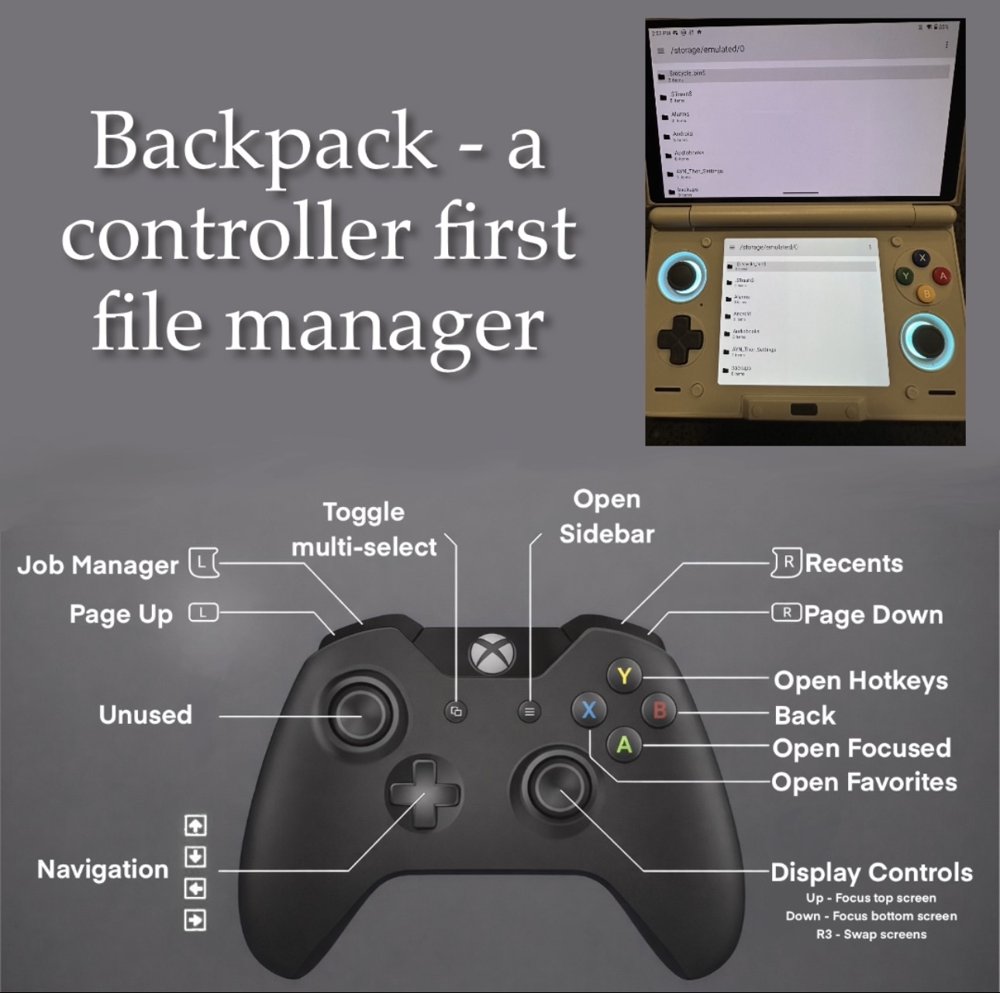
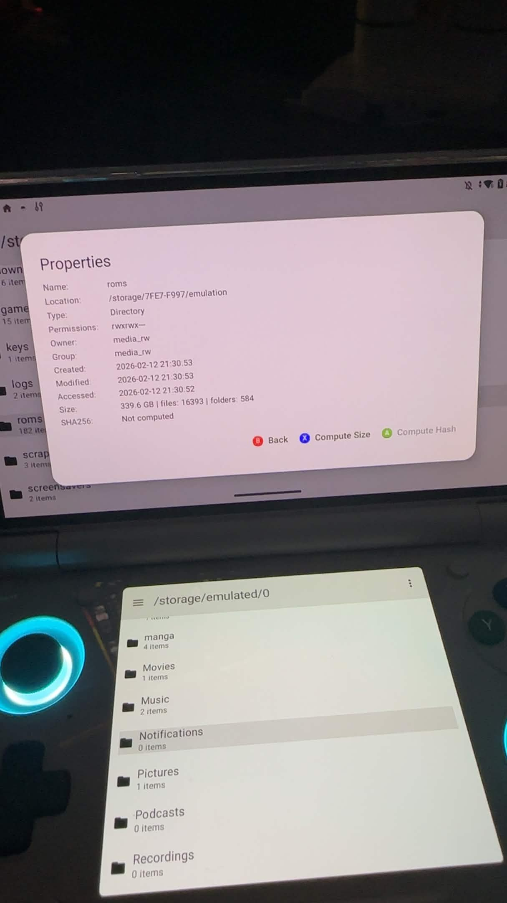
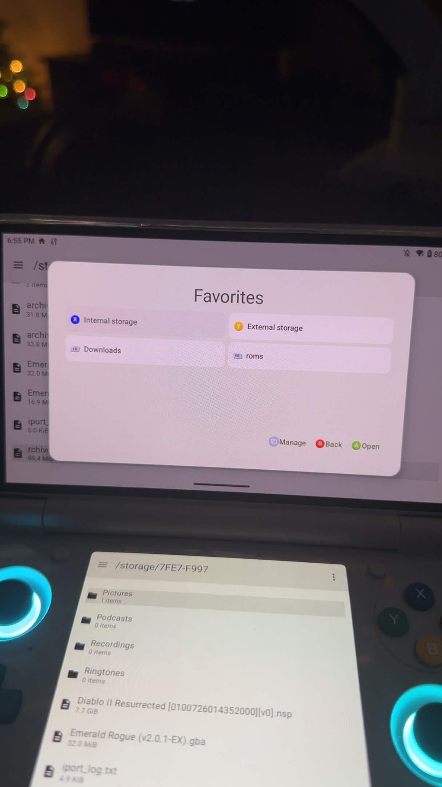
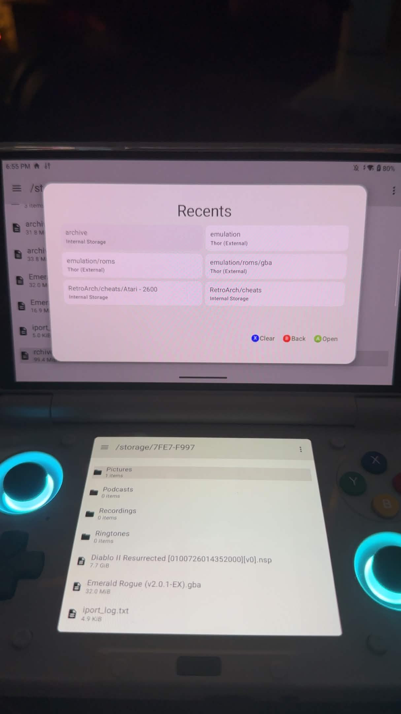
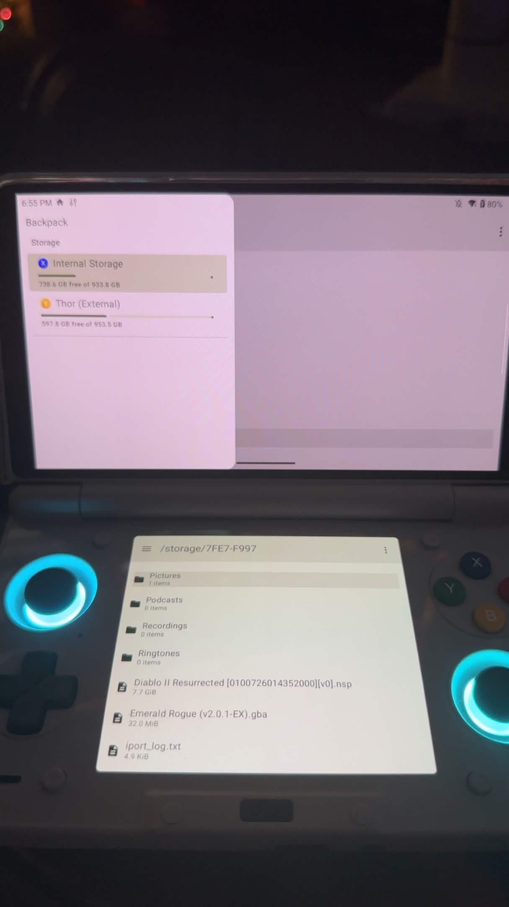
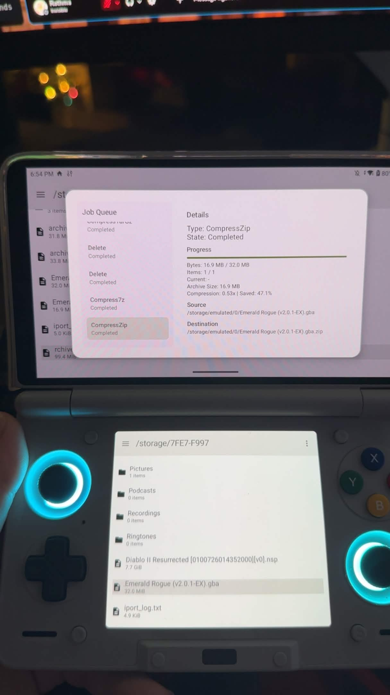

# Backpack

> Dual-screen file manager for Android gaming handhelds with full gamepad navigation

A file manager designed specifically for Android gaming handhelds with external display support. Navigate entirely with your controller using a which-key-style hotkey system—no touch required.

## Demo

- YouTube Short: https://www.youtube.com/shorts/DgoBEA4VJ3I

### Screenshots

<p align="center">
  
  
  
</p>
<p align="center">
  
  
  
</p>

<!-- 

-->

## Features

- **Dual-pane file management** — Browse files on primary and external displays simultaneously
- **Full gamepad navigation** — Which-key-style hierarchical hotkey menus for discoverable controls
- **Archive support** — Browse, extract, and create ZIP, TAR.GZ, and 7Z archives
- **Background job manager** — Queue long-running operations with progress tracking
- **Favorites & recents** — Quick access to frequently used directories

## Installation

Download the latest APK from the [Releases](https://github.com/wrathofrathma/backpackapp/releases) page.

### Requirements

- Android 13+ (SDK 33)
- Recommended: Gaming handheld with external display support

## Device Compatibility

Designed and tested on the **Ayn Thor**.

Other Android 13+ devices may work, but compatibility outside Ayn Thor is not guaranteed yet.

## Controller Mapping

Navigation uses a which-key-style menu system. Press **Y** to open the hotkey overlay, then follow the on-screen prompts.

| Button | Function |
|--------|----------|
| D-Pad | Navigate file list |
| Left Stick | D-Pad navigation |
| A | Select / Open |
| B | Back / Cancel |
| X | Open favorites |
| Y | Open hotkey menu |
| L1 | Page up |
| R1 | Page down |
| L2 | Open Job Manager |
| R2 | Open Recents |
| Right Stick (directional) | Change focused screen |
| R3 (Right Stick Click) | Swap screens |
| Start | System menu |
| Select | Multi-select |

### Hotkey Menu Structure

```
Y → Main Layer
    X  → File
    R1 → UI
    Start → System
    Select → Selection
    R2 → Refresh
    L2 → Favorite

Y → File Layer
    X  → Move
    Y  → Clipboard
    L1 → Delete
    R1 → Rename
    Start → Advanced
    Select → Share
    R2 → New
    L2 → Properties

Y → File → Clipboard
    X → Copy

Y → File → New
    X → New File
    Y → New Folder

Y → File → Advanced
    X  → Compression
    L1 → Hash
    R1 → Duplicate

Y → File → Advanced → Compression
    X  → Compress ZIP
    Y  → Compress TAR.GZ
    L1 → Compress 7Z
    R1 → Decompress Here
    Start → Decompress To...

Y → File → Advanced → Hash
    X  → SHA256 Sum
    Y  → MD5 Sum
    L1 → Compare SHA256
    R1 → Compare MD5

Y → UI
    R2 → Toggle Input Overlay (off by default)
    L2 → Swap Screens

Y → Selection
    X  → Select Mode
    Y  → Clear Selection
    L1 → Select All
    R1 → Invert Selection

Y → System
    L2 → Job Manager
    R2 → Recents
```

## Roadmap

- [ ] FTP server (target: v1.0)
- [ ] Disk space analyzer (target: v1.5)
- [ ] Single-screen mode with split pane / tabs (target: v2.0)
- [ ] Touch input support (target: v2.5)
- [ ] Cloud storage integration (Google Drive, Dropbox) (target: v3.0)
- [ ] Root access support (target: v3.0)
- [ ] Customizable themes (target: v3.5)
- [ ] Samba server (target: TBD)

## About

Source code is maintained in a private repository. Releases are published here.

---

© 2024-2026
